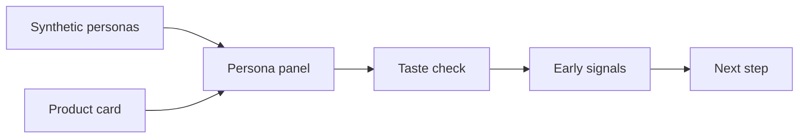

# k-fashion-persona

## Check K-fashion Concepts With AI Personas First

[](pyproject.toml)
[](https://huggingface.co/datasets/nvidia/Nemotron-Personas-Korea)
[](https://github.com/woooya129-ai/k-fashion-persona)
[](https://github.com/woooya129-ai/us-fashion-persona)
[](docs/INSTALL-ENG.md)
[](README.md)
[](LICENSE)
[](CITATION.cff)
[](https://www.linkedin.com/in/woody-kim-ab2741403/)

k-fashion-persona is a local-first Streamlit tool for checking Korean fashion product concepts with synthetic AI personas before launch or formal research.

The twin project for US fashion concepts is [us-fashion-persona](https://github.com/woooya129-ai/us-fashion-persona).

## HF Space License Notice

- The code in this HF Space is licensed under **GNU AGPL-3.0-only**.
- `Protected` HF Space visibility does not remove or weaken the license. It only limits source display and cloning on Hugging Face Hub.
- Access to the running app does not grant source-code transfer, exclusive rights, or commercial relicensing permission.
- If you modify this code and provide it as a network service, review the source-offer obligations under AGPL-3.0-only.
- The default persona dataset, NVIDIA Nemotron-Personas-Korea, is subject to **CC BY 4.0 attribution**.
- The authoritative license and notices are [LICENSE](LICENSE), [NOTICE](NOTICE), and [THIRD_PARTY_NOTICES](docs/THIRD_PARTY_NOTICES.md).

Enter a product card with category, price, fit, material, color, season, wearing context, style tone, brand message, and target hypothesis. The app scans interest reasons, hesitation points, price burden, and fashion risk signals.

This is not a real consumer prediction, purchase-rate prediction, sales prediction, or market-share prediction service.




## What It Does

- Builds a synthetic persona panel with Korean context
- Accepts a product-card style fashion concept
- Filters by age, sex, province, and occupation
- Uses seed-based sampling
- Lets you choose LLM provider/model
- Accepts OpenAI, Anthropic, or Gemini API keys in the UI
- Accepts a Hugging Face token in the UI or external `.env`
- Uses a committed KOSIS public-statistics snapshot
- Optionally refreshes statistics through a KOSIS `statisticsData` API URL
- Exports Markdown and CSV reports

## Data And Statistics

The default persona dataset is [NVIDIA Nemotron-Personas-Korea](https://huggingface.co/datasets/nvidia/Nemotron-Personas-Korea). It is a synthetic persona dataset, not real-person data.

According to the official Hugging Face dataset page, the dataset contains 1M records, 7M persona descriptions, 26 fields, and about 1.98GB of Parquet data. The app's default mode uses Hugging Face `datasets` streaming, so it does not load the full dataset into RAM at once. Filtering and reservoir sampling run locally.

Income and asset values are not inferred as individual persona attributes from the NVIDIA dataset. The report context for income, assets, and household clothing-footwear spending comes from Statistics Korea (KOSTAT) / KOSIS public statistics stored in `data/public/kosis_household_context.csv`.

If you enter a KOSIS API key and a `statisticsData` URL, the run attempts to use that API response first. If refresh fails or no supported metrics are found, it falls back to the committed public-statistics snapshot. For security, API refresh accepts only the `https://kosis.kr/openapi/statisticsData.do` path.

These are household-level aggregate statistics. They do not represent a synthetic persona's real income, assets, or purchasing power.

## Prompt Versions And Optional Assets

The default prompt is `prompts/concept_eval_ko_v0_3.md`. `concept_eval_ko_v0_2` is kept for existing cache and regression-test compatibility. Both prompt versions use the `eval_v0_1` result schema.

Optional first-screen background assets can be placed at `design/hero-skyblue-fabric.png` and `design/direction-bg.png`. If they are missing, the app falls back to built-in backgrounds and logs that once.

## Local Runtime And Recommended Specs

The app UI, dataset filtering, sampling, prompt construction, SQLite cache, and Markdown/CSV report generation run on your local machine. However, the first use of the default Hugging Face dataset reads data from Hugging Face Hub, and LLM evaluation sends prompts to the selected OpenAI, Anthropic, or Gemini API server. KOSIS API requests are made only when API refresh is enabled.

The current version does not run a local LLM or local Vision model, so a graphics card is not required.

| Item | Minimum | Recommended |
|---|---:|---:|
| CPU | 2+ cores | 4+ cores |
| RAM | 8GB | 16GB+ |
| Disk space | 5GB+ free | 10-20GB+ free |
| GPU | Not required | Not required |
| Network | Required for HF dataset loading and LLM API calls | Stable broadband recommended |

Notes:

- The default HF mode streams the dataset and does not load the full 1.98GB into RAM.
- Local CSV/Parquet mode uses pandas and can use more RAM. If you plan to read a full 2GB-class Parquet/CSV file locally, 16-32GB RAM is recommended.
- Large `MAX` runs usually increase LLM API cost and runtime before RAM becomes the main bottleneck.
- If a future mode runs local LLM/Vision models directly, GPU requirements will be separate. The current public version does not use a GPU.

## Quick Start

Requirements:

- Git
- Python 3.11 or newer
- `uv`
- An API key for your chosen LLM provider
- Hugging Face token if needed
- Optional KOSIS API key

```bash
git clone https://github.com/woooya129-ai/k-fashion-persona.git
cd k-fashion-persona
uv sync --all-extras --dev
uv run streamlit run src/app.py
```

Open:

```text
http://localhost:8501
```

To make the local Docs button work, run this in another terminal:

```bash
uv run python -m http.server 8510
```

For the full setup guide, read [docs/INSTALL-ENG.md](docs/INSTALL-ENG.md).

## API Keys

The easiest path is to paste keys into the password fields in the Streamlit UI. The app does not show the raw key value and does not save it to the repository.

For repeated local runs, place a local environment file outside the repository.

### macOS / Linux

```bash
mkdir -p ~/secrets/k-fashion
cp .env.example ~/secrets/k-fashion/.env
```

### Windows PowerShell

```powershell
New-Item -ItemType Directory -Force "$HOME\secrets\k-fashion"
Copy-Item .env.example "$HOME\secrets\k-fashion\.env"
```

Environment file example:

```env
OPENAI_API_KEY=
ANTHROPIC_API_KEY=
GOOGLE_API_KEY=
HF_TOKEN=
KOSIS_API_KEY=
KOSIS_STATISTICS_DATA_URL=
```

`GOOGLE_API_KEY` is for the Gemini API key from Google AI Studio, not Vertex AI.

Do not place or commit a real `.env` file in the repository root.

## How To Use

1. Run the Streamlit app.
2. Choose a provider and model.
3. Enter the provider API key.
4. Enter `HF TOKEN` if needed.
5. Choose the KOSIS reference segment.
6. Optionally enter `KOSIS API KEY` and `KOSIS statisticsData URL`, then enable API refresh.
7. Fill in the product card.
8. Adjust sample size, seed, and filters.
9. Confirm estimated cost and time.
10. Press `ENTER`.
11. Download the Markdown or CSV report.

Product-card fields:

- Category
- Price
- Fit / silhouette
- Material
- Color
- Season
- Wearing context
- Style tone
- Target hypothesis
- Brand message / product description

For local CSV or Parquet data, files must stay under `data/`. The recommended path is `data/raw/`.

## Report Example

Below is a shortened Markdown report example. Numbers are illustrative. Real output depends on the product concept, persona filter, provider/model, sampling seed, and KOSIS reference segment.

```markdown
# k-fashion-persona — Synthetic Persona Panel Report

## Synthetic Panel Reaction Distribution

| Metric | Value |
|---|---|
| Positive reactions | 18 / 40 |
| Neutral reactions | 14 / 40 |
| Negative reactions | 8 / 40 |
| Average interest score | 6.4 / 10 |
| Price burden high or above | 13 / 40 |

## KOSIS Reference Statistics

- Reference segment: National total
- Reference period: 2025_Q4, 2025, 2024
- Price denominator: KRW 2,136,000 (annualized household clothing-footwear spending)
- Product price / denominator: 0.09x (medium)

| Metric | Value | Period | Source |
|---|---:|---|---|
| Annualized clothing-footwear spending | KRW 2,136,000 | 2025_Q4 | 2025 Q4 Household Income and Expenditure Survey |
| Monthly clothing-footwear spending | KRW 178,000 | 2025_Q4 | 2025 Q4 Household Income and Expenditure Survey |
| Monthly household income | KRW 5,422,000 | 2025_Q4 | 2025 Q4 Household Income and Expenditure Survey |
| Average household assets | KRW 566,780,000 | 2025 | 2025 Household Finance and Welfare Survey |

> These values are KOSIS/KOSTAT household aggregate statistics. They do not mean individual persona income, assets, or purchasing power.

## Main Positive Reasons

- Works for both office wear and weekend outings
- Light khaki fits the spring season
- Water-resistant cotton blend feels practical

## Main Hesitation Reasons

- KRW 189,000 may feel high for a basic outerwear item
- Semi-oversized fit may look bulky on some body types
- Care instructions and wrinkle resistance need more detail

## Fashion Risk Signals

| Category | Signal Count | Example Concern |
|---|---:|---|
| Price burden | 6 | Price feels high |
| Fit risk | 4 | Semi-oversized fit may look bulky |
| Material/care burden | 3 | Washing and wrinkles are a concern |

---

Persona dataset: NVIDIA Nemotron-Personas-Korea, CC BY 4.0.
Public statistics context uses Statistics Korea (KOSTAT) / KOSIS household clothing-footwear spending, income, and asset statistics; it does not infer individual income or assets.
Built with Codex and Claude Code.
Contact: woooya129 [at] gmail [dot] com
```

CSV reports flatten the same content into `section,key,value`.

## Interpreting Results

Appropriate use:

- Drafting survey questions before formal research
- Finding weak points in product descriptions
- Reviewing price, material, fit, and styling risks
- Comparing early concept candidates

Inappropriate use:

- Real purchase-rate prediction
- Real sales prediction
- Market-share prediction
- Replacement for real consumer research
- Sole basis for launch, production, or inventory decisions

## Limits

- This is not a real consumer-data prediction model.
- Synthetic persona reactions can differ from real buying behavior.
- The dataset is not built specifically for fashion purchase research.
- Images, lookbooks, fit photos, and body measurements are not included by default.
- KOSIS/KOSTAT values are household-level aggregate statistics, not individual persona economics.
- Final decisions should combine real research, sales data, and expert review.

## License And Attribution

- Code license: GNU AGPL-3.0-only
- Persona dataset: NVIDIA Nemotron-Personas-Korea
- Dataset license: CC BY 4.0 attribution applies
- Statistics context: KOSTAT / KOSIS public statistics

Review AGPL-3.0-only terms before using this in a commercial service or closed-source product.

### License And Commercial Use

- Open source: GNU AGPL-3.0-only (`LICENSE` file)
- Commercial license: closed-source commercial use, internal SaaS, redistributed products, or use cases that cannot adopt AGPL terms may be handled under a separate written commercial license or dual-license arrangement

Contact: woooya129 [at] gmail [dot] com

### Attribution And Methodology

- Citation format: `CITATION.cff`
- Methodology and rights positioning: `docs/METHODOLOGY_AND_RIGHTS.md`
- This repository does not claim ownership of an abstract idea. It separates
  public source code, documentation, prompts, report structure, branding, and
  commercial adoption terms.
- Closed-source products, internal SaaS, paid consulting workflows, and official
  branding use should be handled through commercial-license discussion.

Built with Codex and Claude Code.

## v0.5.0 Runtime Layout

- `src/app.py`: Streamlit entry point and public compatibility wrappers for tests
- `src/app_config.py`: shared app constants and run presets
- `src/ui/`: UI copy, CSS, static assets, and rendering helpers
- `src/orchestrator/`: data loading, persona payload construction, cache use, LLM evaluation, and report assembly
- Existing tests that monkeypatch `src.app` keep the same public import path

## Contact

woooya129 [at] gmail [dot] com
