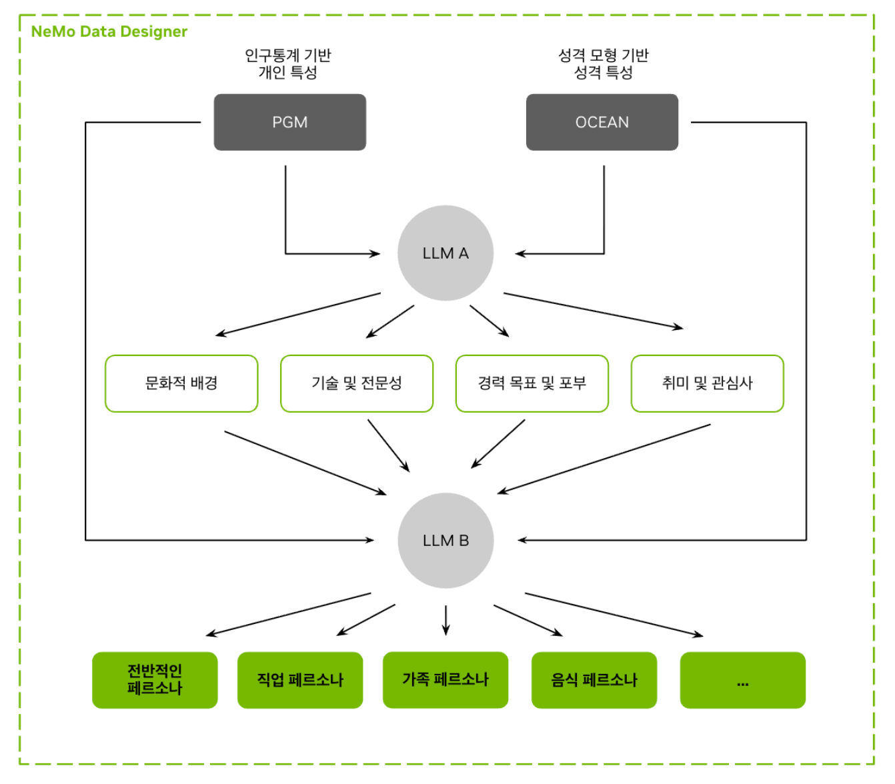

<table align="right">
  <tr>
    <td align="left" valign="middle" width="128" height="128">
      
    </td>
    <td align="left" valign="middle" height="128">
      <h2>
        <strong><b>k</b></strong><br />
        <strong><b>fashion</b></strong><br />
        <strong><b>persona</b></strong>
      </h2>
    </td>
  </tr>
</table>

# K-fashion 컨셉을 AI 페르소나로 먼저 점검

[](pyproject.toml)
[](https://huggingface.co/datasets/nvidia/Nemotron-Personas-Korea)
[](https://github.com/woooya129-ai/k-fashion-persona)
[](https://huggingface.co/spaces/w00ya/k-fashion-persona)
[](https://w00ya-k-fashion-persona.hf.space)
[](docs/INSTALL.md)
[](docs/README-ENG.md)
[](LICENSE)


`k-fashion-persona`는 한국 패션 제품 컨셉을 출시 전 단계에서 합성 페르소나 기반 사전 리스크 점검으로 읽는 local-first Streamlit 도구입니다. 제품 카드와 필터를 넣으면 합성 페르소나 패널이 관심 이유, 망설임, 가격 부담, 패션 리스크를 Markdown/CSV 리포트로 정리합니다.

실제 구매 행동, 매출, 시장 점유율을 예측하는 서비스가 아닙니다. 설문, 인터뷰, 판매 데이터 분석 전에 가설을 좁히는 보조 도구입니다.

## Nemotron-Personas-Korea 소개



Nemotron-Personas-Korea는 NVIDIA가 2026년 4월 공개한 CC BY 4.0 한국어 합성 페르소나 데이터셋입니다. KOSIS, 대법원, 국민건강보험공단, 한국농촌경제연구원, NAVER Cloud 통계 분포를 바탕으로 이름, 나이, 직업, 지역, 교육 수준 등을 합성해 한국 사회의 다양한 맥락을 반영합니다.

기존 영어 중심 데이터셋에서 과소 표현되던 고령층, 농촌 지역, 저학력 직군의 공백을 줄이고 한국어 AI의 편향 완화와 응답 다양성 향상을 돕습니다.

## 빠른 이해

| 구분 | 내용 |
|:---|:---|
| 입력 | 카테고리, 가격, 핏, 소재, 컬러, 시즌, 착용 상황, 스타일 톤, 타깃 가설, 제품 설명 |
| 패널 | NVIDIA Nemotron-Personas-Korea 기반 합성 페르소나 |
| 필터 | 연령, 성별, 지역, 직업, seed, 샘플 수 |
| 출력 | 반응 분포, 관심도, 주요 이유, 주요 우려, 가격 부담, 대표 카드, Markdown/CSV |
| 기본 프리셋 | FAST 50명, BALANCE 100명, HIGH 300명, MAX 1000명 |
| Advanced | 샘플 수 직접 입력 가능 |


## 리포트 예시

```markdown
# k-fashion-persona — 합성 패널 분석 리포트

합성 페르소나 기반 사전 리스크 점검 리포트입니다.

> **주의**: 기본 리포트 권장

## 먼저 볼 요약

- 합성 패널 100명 기준 긍정 반응이 80.0%로 우세합니다.
- 주요 긍정 이유는 오프화이트 컬러와 출근 코디 활용성입니다.
- 검증 필요 가능성은 소재/관리 부담과 핏 리스크에 집중됩니다.

**프로젝트명**: 출근 셔츠 컨셉

**컨셉 입력**:

- 카테고리: 남성 셔츠
- 가격: 129,000원
- 핏: 세미 오버핏
- 소재: 코튼 100%
- 컬러: 오프화이트
- 시즌: 봄, 가을
- 착용 상황: 출근, 미팅
- 스타일 톤: 정돈된 클래식
- 타깃 가설: 실용성과 관리 편의성을 보는 직장인
- 브랜드 메시지/제품 설명: 구김을 줄인 코튼 셔츠. 단정한 인상과 편한 움직임을 함께 고려한 데일리 출근 아이템.

## 합성 패널 100명 기준 반응 분포

| 항목 | 값 |
|---|---|
| 긍정 반응 | 80명 / 80.0% |
| 중립 반응 | 20명 / 20.0% |
| 부정 반응 | 0명 / 0.0% |
| 평균 관심도 | 6.8 / 10 |
| 가격 부담도 high 이상 | 0명 / 0.0% |
| 파싱 실패/제외 | 0명 |

## KOSIS 참고 통계

- 기준 계층: 전국 전체
- 참고 기간: 2024, 2025, 2025_Q4
- API 호출 상태: snapshot
- 가격 기준값: 2,136,000원 (연간 환산 의류·신발 지출)
- 제품 가격 / 기준값: 0.06배 (medium)

| 항목 | 값 | 기간 | 출처 |
|---|---:|---|---|
| 연간 환산 의류·신발 지출 | 2,136,000원 | 2025_Q4 | 2025년 4/4분기 가계동향조사 결과 |
| 월평균 의류·신발 지출 | 178,000원 | 2025_Q4 | 2025년 4/4분기 가계동향조사 결과 |
| 월평균 가구소득 | 5,422,000원 | 2025_Q4 | 2025년 4/4분기 가계동향조사 결과 |
| 월평균 처분가능소득 | 4,349,000원 | 2025_Q4 | 2025년 4/4분기 가계동향조사 결과 |
| 평균 가구자산 | 566,780,000원 | 2025 | 2025년 가계금융복지조사 결과 |
| 평균 가구부채 | 95,340,000원 | 2025 | 2025년 가계금융복지조사 결과 |
| 평균 가구순자산 | 471,440,000원 | 2025 | 2025년 가계금융복지조사 결과 |
| 연평균 가구소득 | 74,270,000원 | 2024 | 2025년 가계금융복지조사 결과 |

> 위 값은 KOSIS/KOSTAT 가구 단위 집계 통계이며, 개별 페르소나의 실제 소득·자산·구매력을 뜻하지 않습니다.

## 입력 기준 요약

| 항목 | 값 |
|---|---|
| 디자인 디테일 | 장식 없음 |
| 동급 브랜드 대비 가격 위치 | 모르겠음 |

> 동급 브랜드 대비 가격 위치는 사용자 자가 입력값이며, LLM 프롬프트에는 전달하지 않습니다.

## 표본 구성 보조

| 항목 | 값 |
|---|---|
| 최초 필터 통과 | 100명 |
| 인접 연령 보조 적용 | 아니오 |
| 확장 후 필터 통과 | 100명 |
| 보조 포함 비율 | 0% (±5세 확장으로 추가된 페르소나 0명) |
| 확장 후 표본 부족 상태 | 아니오 |

> 보조 포함 비율은 선택 연령 범위가 부족할 때 한 번만 인접 연령을 확장해 포함한 합성 페르소나 비율입니다.

## 결과 품질

| 항목 | 수 |
|---|---|
| 성공 | 100명 |
| 파싱 실패 | 0명 |
| API 실패 | 0명 |
| 분포 계산 포함 | 100명 |

## 검증 필요 가능성

| 항목 | 건수 |
|---|---:|
| 입력 가격 불일치 가능 | 0 |
| 미입력 디자인 요소 언급 가능 | 0 |
| 성별 맥락 불일치 가능 | 0 |
| 착용 상황 불일치 가능 | 7 |

> 이 표는 확정 오류가 아니라 입력과 응답 사이의 검증 필요 가능성을 표시합니다.

## 가격 부담도 분포

| 라벨 | 명수 |
|---|---|
| low | 0명 |
| medium | 100명 |
| high | 0명 |
| very_high | 0명 |
| unknown | 0명 |

## 주요 긍정 이유 (합성 패널 응답 기준)

- 오프화이트 컬러는 어떤 바지와도 무난하게 어울려 코디 고민을 줄여줌 (5건)
- 오프화이트 컬러는 어떤 하의와도 매치하기 쉬워 코디 고민을 줄여줌 (3건)
- 오프화이트 컬러는 어떤 하의와도 매치하기 쉬워 코디 고민을 덜어줌 (3건)
- 코튼 100% 소재라 피부에 닿는 느낌이 편안할 것 같음 (2건)
- 구김을 줄인 코튼 소재라는 점이 관리 측면에서 실용적으로 느껴짐 (2건)

## 주요 망설임 이유 (합성 패널 응답 기준)

- 세미 오버핏이 자칫 너무 벙벙해 보이지 않을지 실제 핏에 대한 확인이 필요함 (4건)
- 세미 오버핏이 자칫 너무 벙벙해 보이지 않을지 핏 리스크 우려 (3건)
- 세미 오버핏이 자칫 너무 캐주얼해 보이지 않을지 실제 핏 확인이 필요함 (3건)
- 코튼 100% 소재의 경우 세탁 후 실제 구김 정도가 어느 정도일지 확인이 필요함 (2건)
- 세미 오버핏이 자칫 너무 루즈해 보이지 않을지 실착 핏에 대한 우려가 있음 (2건)

## 패션 위험 신호 (합성 패널 main_concerns 분류)

| 카테고리 | 신호 수 | 대표 concern 예시 |
|---|---:|---|
| 가격 부담 | 78 | 129,000원이라는 가격이 데일리 셔츠로 매일 입기에는 다소 신중하게 고민되는 수준임, 129,000원이라는 가격이 데일리 셔츠로 매일 입기에는 다소 고민되는 수준임, 129,000원이라는 가격이 데일리 셔츠로 매일 입기에는 다소 부담스럽게 느껴질 수 있음 |
| 핏 리스크 | 66 | 세미 오버핏이 자칫 너무 벙벙해 보이지 않을지 핏 리스크 우려, 세미 오버핏이 자칫 너무 캐주얼해 보이지 않을지 실제 핏 확인이 필요함, 세미 오버핏이 자칫 너무 캐주얼해 보이지 않을지 핏 리스크 확인 필요 |
| 소재/관리 부담 | 119 | 코튼 100% 소재의 경우 세탁 후 실제 구김 정도가 어느 정도일지 확인이 필요함, 코튼 100% 소재의 경우 세탁 후 수축이나 변형이 생기지 않을지 우려됨, 코튼 100% 소재는 세탁 후 다림질이 번거로울까 봐 걱정됨 |
| 코디 난이도 | 0 |  |
| 착용 상황 불일치 | 7 | 오프화이트는 밝은 색이라 음식물이 튀거나 오염될까 봐 착용 상황에서 조심스러움, 오프화이트 색상은 현장 작업 시 오염이 쉽게 눈에 띌까 봐 착용 상황이 제한적일 것 같음, 출근이나 미팅보다는 동네 산책이나 친구 모임이 주 일상이라 착용 상황이 다소 제한적임 |
| 구매 망설임 | 7 | 온라인 구매 시 실제 색감과 질감을 직접 확인하기 어려운 점이 망설임 요인임, 구매 망설임: 기존에 보유한 셔츠들과의 차별성이 크지 않다면 선뜻 구매하기 어려움, 현장 일을 할 때 셔츠가 너무 빳빳하거나 활동하기 불편할까 봐 망설여진다 |
| 스타일 부담 | 0 |  |

> 분류 대상 concern 총 333건 중 미분류 56건 (키워드 매칭 안 됨, 수정 제안에서는 제외).

## 가격 부담 해석

- 가격 부담도 high 이상: 0명 / 0.0%
- main_concerns 가격 관련 신호: 78건
- 대표 concern: 129,000원이라는 가격이 데일리 셔츠로 매일 입기에는 다소 신중하게 고민되는 수준임, 129,000원이라는 가격이 데일리 셔츠로 매일 입기에는 다소 고민되는 수준임, 129,000원이라는 가격이 데일리 셔츠로 매일 입기에는 다소 부담스럽게 느껴질 수 있음

> 합성 패널 응답 기준의 가격 신호 분포일 뿐, 실제 가격 수용성이나 실제 결제 결정의 근거가 아닙니다.

## 스타일/코디 장벽

- 착용 상황 불일치: 7건 — 오프화이트는 밝은 색이라 음식물이 튀거나 오염될까 봐 착용 상황에서 조심스러움, 오프화이트 색상은 현장 작업 시 오염이 쉽게 눈에 띌까 봐 착용 상황이 제한적일 것 같음, 출근이나 미팅보다는 동네 산책이나 친구 모임이 주 일상이라 착용 상황이 다소 제한적임
- 핏 리스크: 66건 — 세미 오버핏이 자칫 너무 벙벙해 보이지 않을지 핏 리스크 우려, 세미 오버핏이 자칫 너무 캐주얼해 보이지 않을지 실제 핏 확인이 필요함, 세미 오버핏이 자칫 너무 캐주얼해 보이지 않을지 핏 리스크 확인 필요
- 소재/관리 부담: 119건 — 코튼 100% 소재의 경우 세탁 후 실제 구김 정도가 어느 정도일지 확인이 필요함, 코튼 100% 소재의 경우 세탁 후 수축이나 변형이 생기지 않을지 우려됨, 코튼 100% 소재는 세탁 후 다림질이 번거로울까 봐 걱정됨

## 구매 망설임

- 구매 망설임 신호: 7건
- 대표 concern: 온라인 구매 시 실제 색감과 질감을 직접 확인하기 어려운 점이 망설임 요인임, 구매 망설임: 기존에 보유한 셔츠들과의 차별성이 크지 않다면 선뜻 구매하기 어려움, 현장 일을 할 때 셔츠가 너무 빳빳하거나 활동하기 불편할까 봐 망설여진다

## 수정 제안 후보 (deterministic rule, LLM 호출 없음)

1. **소재/관리 부담** (신호 119건)
   - 세탁/관리 난이도 안내를 보강하거나 대체 소재 검토를 함께 표시하는 방향이 후보입니다.
2. **가격 부담** (신호 78건)
   - 소재/디테일/구성 대비 가격 설명을 강화하거나, 보다 낮은 엔트리 가격 옵션을 함께 제시하는 방향이 후보입니다.
3. **핏 리스크** (신호 66건)
   - 사이즈 가이드, 착용 컷, 체형별 안내를 보강하는 방향이 후보입니다.
4. **착용 상황 불일치** (신호 7건)
   - 타깃 occasion 을 재정의하거나 주력 사용 장면을 좁혀 보는 방향이 후보입니다.
5. **구매 망설임** (신호 7건)
   - 차별 포인트, 관리 편의성, 실착 이미지가 더 필요한지 점검하는 방향이 후보입니다.

> 위 제안은 합성 패널 응답을 키워드 규칙으로 분류한 결과를 기반으로 한 후보 방향이며, 실제 소비자 의견을 대체하거나 실제 매출/판매 결과를 보장하지 않습니다.

## 대표 페르소나 반응 (추상화 라벨, 원문 비포함)

| 세그먼트 | 반응 | 관심도 | 대표 긍정 이유 |
|---|---|---:|---|
| 36세 / 서울 / 투자신탁 전문가 | positive | 8 | 구김을 줄인 코튼 소재가 바쁜 출근 시간의 관리 부담을 덜어줄 것으로 기대됨 |
| 72세 / 경기 / 무직 | neutral | 5 | 오프화이트 컬러가 단정하고 깔끔해 보여 손주들과의 외출이나 모임에 적합해 보임 |

## 연령대별 반응 (합성 패널 기준)

| 세그먼트 | n | 긍정률 | 평균 관심도 |
|---|---:|---:|---:|
| 20대 | 19 | 73.7% | 6.7 |
| 30대 | 18 | 100.0% | 7.3 |
| 40대 | 15 | 100.0% | 7.3 |
| 50대 | 15 | 93.3% | 7.1 |
| 60대 | 19 | 73.7% | 6.5 |
| 70대 이상 | 14 | 35.7% | 5.6 |

## 성별 반응 (합성 패널 기준)

| 세그먼트 | n | 긍정률 | 평균 관심도 |
|---|---:|---:|---:|
| M | 100 | 80.0% | 6.8 |

## 지역별 반응 (합성 패널 기준)

| 세그먼트 | n | 긍정률 | 평균 관심도 |
|---|---:|---:|---:|
| 강원 | 5 | 80.0% | 6.6 |
| 경기 | 26 | 80.8% | 6.7 |
| 경상남 | 5 | 80.0% | 6.8 |
| 경상북 | 3 | 66.7% | 6.3 |
| 광주 | 2 | 50.0% | 6.0 |
| 대구 | 7 | 100.0% | 7.4 |
| 대전 | 3 | 66.7% | 7.3 |
| 부산 | 9 | 55.6% | 6.1 |
| 서울 | 22 | 77.3% | 6.9 |
| 세종 | 1 | 100.0% | 8.0 |
| 울산 | 2 | 100.0% | 7.0 |
| 인천 | 2 | 100.0% | 7.0 |
| 전라남 | 2 | 100.0% | 7.0 |
| 전북 | 1 | 100.0% | 7.0 |
| 제주 | 2 | 100.0% | 7.0 |
| 충청남 | 6 | 100.0% | 7.0 |
| 충청북 | 2 | 50.0% | 6.5 |

## 직업 계열별 반응 (합성 패널 기준)

| 세그먼트 | n | 긍정률 | 평균 관심도 |
|---|---:|---:|---:|
| 119 | 1 | 100.0% | 7.0 |
| 강구조물 | 2 | 100.0% | 7.0 |
| 건물 | 5 | 80.0% | 6.6 |
| 건물용 | 1 | 100.0% | 7.0 |
| 경리 | 2 | 100.0% | 7.5 |
| 경영 | 2 | 100.0% | 7.5 |
| 관리 | 1 | 100.0% | 7.0 |
| 교육 | 1 | 100.0% | 7.0 |
| 교통 | 1 | 100.0% | 7.0 |
| 국어 | 1 | 100.0% | 8.0 |
| 그 | 8 | 87.5% | 7.1 |
| 냉난방기 | 1 | 100.0% | 7.0 |
| 노점 | 1 | 100.0% | 7.0 |
| 농수산물 | 1 | 100.0% | 7.0 |
| 무직 | 26 | 46.2% | 6.0 |
| 부동산 | 1 | 100.0% | 7.0 |
| 사무 | 2 | 100.0% | 7.0 |
| 산업 | 2 | 100.0% | 7.0 |
| 상·하수 | 2 | 0.0% | 5.5 |
| 언어재활사 | 1 | 100.0% | 8.0 |
| 영업 | 3 | 100.0% | 7.7 |
| 온라인 | 1 | 100.0% | 7.0 |
| 위험 | 1 | 100.0% | 7.0 |
| 육군 | 1 | 100.0% | 7.0 |
| 일반 | 2 | 100.0% | 7.5 |
| 일식 | 1 | 100.0% | 7.0 |
| 전기 | 2 | 100.0% | 7.0 |
| 전자계측 | 1 | 100.0% | 7.0 |
| 전자제품 | 1 | 100.0% | 8.0 |
| 전직 | 3 | 100.0% | 7.0 |
| 전화 | 3 | 100.0% | 7.0 |
| 정보 | 1 | 100.0% | 8.0 |
| 중형 | 1 | 100.0% | 7.0 |
| 지게차 | 1 | 100.0% | 7.0 |
| 철도교통 | 1 | 100.0% | 7.0 |
| 철도운송 | 2 | 100.0% | 7.5 |
| 치과위생사 | 1 | 100.0% | 7.0 |
| 택배원 | 1 | 100.0% | 7.0 |
| 통신장비 | 2 | 100.0% | 7.0 |
| 투자신탁 | 1 | 100.0% | 8.0 |
| 플랜트공학 | 1 | 100.0% | 7.0 |
| 하역 | 3 | 33.3% | 5.3 |
| 해군 | 1 | 100.0% | 7.0 |
| 해양 | 1 | 100.0% | 7.0 |
| 회계 | 1 | 100.0% | 7.0 |
| 회계사 | 1 | 100.0% | 8.0 |

## 가격 부담도별 반응 (합성 패널 기준)

| 세그먼트 | n | 긍정률 | 평균 관심도 |
|---|---:|---:|---:|
| medium | 100 | 80.0% | 6.8 |

---

본 도구는 합성 페르소나와 LLM 기반의 사전 가설 분석 도구입니다.
실제 소비자 조사, 매출 예측, 법률 자문, 최종 사업 판단을 대체하지 않습니다.
모델 성능에 따라 한국어 품질, JSON 안정성, 분석 깊이가 달라질 수 있습니다.
Persona dataset: NVIDIA Nemotron-Personas-Korea, CC BY 4.0.
Dataset URL: https://huggingface.co/datasets/nvidia/Nemotron-Personas-Korea
CC BY 4.0: https://creativecommons.org/licenses/by/4.0/
This beta uses the creator's personal paid Gemini 3.1 Flash-Lite API; API charges are billed to the creator. Google documentation states paid API requests and responses are not used to improve products. Do not include personal, sensitive, or trade-secret information.
k-fashion-persona.
Public statistics context uses Statistics Korea (KOSTAT) / KOSIS household clothing-footwear spending, income, and asset statistics; it does not infer individual income or assets.
Built with Codex and Claude Code.
Contact: woooya129 [at] gmail [dot] com
```

## 실행 구조

- 앱 UI, 데이터셋 필터링, 샘플링, 프롬프트 생성, SQLite 캐시, Markdown/CSV 리포트 생성은 사용자 PC에서 로컬로 실행됩니다.
- Streamlit API 모드는 사용자가 선택한 provider API 서버로 프롬프트를 전송합니다.
- Agent Pack 모드는 프롬프트 파일을 내보내고, 사용자의 Codex 또는 Claude Code CLI가 평가합니다.
- API key는 앱이 저장하지 않습니다. 화면 입력값은 현재 Streamlit 세션에서만 사용합니다.
- LLM API endpoint는 `config/pricing_config.yaml`의 `api_base_url` host만 허용합니다. 설정을 바꾸면 허용 host set도 바뀌므로 공유 배포에서는 코드 리뷰 대상으로 봐야 합니다.
- 공개 HF Space는 `KFPS_REQUIRE_USER_PROVIDER_KEY=1`로 배포됩니다. 운영자 공용 LLM provider API key를 사용하지 않으며, 사용자가 본인 key를 입력해야 실행됩니다.

## 설치 방법

필요 조건:

- Git
- Python 3.11 이상
- `uv`
- 사용할 LLM provider API key 또는 로그인된 Codex/Claude Code CLI
- 필요 시 Hugging Face token

설치:

```bash
git clone https://github.com/woooya129-ai/k-fashion-persona.git
cd k-fashion-persona
uv sync --all-extras --dev
```

자세한 설치는 [docs/INSTALL.md](docs/INSTALL.md)를 참고하세요.

## 빠른 실행

```bash
uv run streamlit run src/app.py
```

브라우저에서 엽니다.

```text
http://localhost:8501
```

## 일반 사용

1. Streamlit 앱을 실행합니다.
2. provider와 model을 고릅니다.
3. provider API key를 입력합니다.
4. 제품 카드를 입력합니다.
5. 샘플 수, seed, 페르소나 필터를 조정합니다.
6. 예상 비용과 시간을 확인합니다.
7. `ENTER`로 실행하고 Markdown 또는 CSV 리포트를 내려받습니다.

반복 실행용 key는 저장소 밖 환경 파일이나 OS 환경변수에 둡니다. 저장소 root에 실제 `.env` 파일을 두거나 commit하지 마세요.

```env
OPENAI_API_KEY=
ANTHROPIC_API_KEY=
GOOGLE_API_KEY=
GROQ_API_KEY=
DEEPSEEK_API_KEY=
QWEN_API_KEY=
HF_TOKEN=
KOSIS_API_KEY=
KOSIS_STATISTICS_DATA_URL=
```

## 구독형 Codex / Claude Code

구독형 Codex 또는 Claude Code 사용자는 `Agent Pack` 방식으로 API key 없이도 평가 흐름을 쓸 수 있습니다. 앱이 Codex/Claude를 provider처럼 자동 호출하는 구조가 아니라, `export -> CLI 실행 -> import` 순서의 오프라인 브릿지입니다.

Codex CLI:

```powershell
npm install -g @openai/codex
codex
```

Claude Code:

```powershell
irm https://claude.ai/install.ps1 | iex
claude
```

Agent Pack 생성:

```powershell
uv run python -m src.agent_bridge export --concept examples/agent_bridge_concept.example.json --out outputs/agent-pack-demo --sample-size 50 --audience unisex
```

Codex 실행 후 import:

```powershell
powershell -ExecutionPolicy Bypass -File outputs\agent-pack-demo\commands\run-codex.ps1
uv run python -m src.agent_bridge import --pack outputs\agent-pack-demo --results outputs\agent-pack-demo\results\codex --out outputs\agent-report-codex
```

Claude Code 실행 후 import:

```powershell
powershell -ExecutionPolicy Bypass -File outputs\agent-pack-demo\commands\run-claude.ps1
uv run python -m src.agent_bridge import --pack outputs\agent-pack-demo --results outputs\agent-pack-demo\results\claude --out outputs\agent-report-claude
```

메모:

- 50명 평가는 CLI 호출 50번입니다. 처음에는 `--sample-size 5` 또는 `--sample-size 10`으로 확인하세요.
- Claude 구독 계정은 기본 `run-claude.ps1`을 그대로 쓰면 됩니다. `KFPS_CLAUDE_BARE=1`은 API key 또는 별도 auth helper 자동화용입니다.
- 결과물은 `agent-report.md`, `agent-report.csv`, `normalized-results.jsonl`입니다.
- Codex 문서: [OpenAI Codex CLI](https://developers.openai.com/codex/cli)
- Claude 문서: [Claude Code setup](https://code.claude.com/docs/en/setup)

## 데이터와 통계

- 기본 데이터셋: [NVIDIA Nemotron-Personas-Korea](https://huggingface.co/datasets/nvidia/Nemotron-Personas-Korea)
- 데이터 성격: 실제 인물 데이터가 아닌 한국 맥락 합성 페르소나
- 라이선스: CC BY 4.0 attribution
- 크기: Hugging Face 공식 기준 100만 레코드, 700만 페르소나 설명, 26개 필드, 약 1.98GB Parquet
- 기본 로딩: Hugging Face `datasets` streaming
- 기본 scan: 실행마다 최대 3000행까지 순차 scan해서 조건에 맞는 패널을 채움

소득, 자산, 의류·신발 지출은 개별 페르소나에서 추정하지 않습니다. 리포트의 가격 부담 참고값은 KOSTAT/KOSIS 공개 통계 스냅샷 `data/public/kosis_household_context.csv`를 사용합니다. KOSIS API key와 `statisticsData` URL을 입력하면 실행 시 해당 응답을 먼저 참고하고, 실패하면 스냅샷으로 fallback합니다.

## 권장 사양

| 구분 | 최소 | 권장 |
|---|---:|---:|
| CPU | 2코어 이상 | 4코어 이상 |
| RAM | 8GB | 16GB 이상 |
| 저장공간 | 5GB 이상 여유 | 10-20GB 이상 여유 |
| GPU | 필요 없음 | 필요 없음 |
| 네트워크 | HF 데이터셋 로딩과 LLM API 호출에 필요 | 안정적인 broadband 권장 |

큰 샘플은 RAM보다 LLM API 비용과 실행 시간이 먼저 증가합니다.

## 결과 해석

적절한 사용:

- 정식 조사 전 설문 문항 정리
- 제품 설명의 약점 찾기
- 가격, 소재, 핏, 코디 리스크 점검
- 여러 컨셉 후보의 초기 비교

부적절한 사용:

- 실제 구매 전환 수치 산정
- 실제 매출 규모 산정
- 시장 점유율 산정
- 실제 소비자 조사의 대체
- 출시, 생산, 발주 의사결정의 단독 근거

## 한계

- 합성 페르소나 반응은 실제 소비자 행동과 다를 수 있습니다.
- 데이터셋은 패션 구매 전용 데이터가 아닙니다.
- 이미지, 룩북, 착용 사진, 체형 정보는 기본 평가에 포함되지 않습니다.
- KOSIS/KOSTAT 값은 가구 단위 집계 통계이며, 개별 페르소나의 실제 경제 상태가 아닙니다.
- 최종 판단은 실제 조사, 판매 데이터, 전문가 검토와 함께 해야 합니다.

## 라이선스와 출처

- 코드 라이선스: GNU AGPL-3.0-only
- 기본 페르소나 데이터셋: NVIDIA Nemotron-Personas-Korea
- 데이터셋 라이선스: CC BY 4.0 attribution
- 통계 컨텍스트: KOSTAT / KOSIS 공개 통계
- 전체 고지: [LICENSE](LICENSE), [NOTICE](docs/legal/NOTICE.md), [THIRD_PARTY_NOTICES](docs/legal/THIRD_PARTY_NOTICES.md)
- 인용 형식: [CITATION.cff](CITATION.cff)
- 방법론: [docs/legal/METHODOLOGY_AND_RIGHTS.md](docs/legal/METHODOLOGY_AND_RIGHTS.md)

상업적 폐쇄 도입, 사내 SaaS, 재배포 제품, AGPL 조건 적용이 어려운 사용은 별도 상용 라이선스 또는 듀얼 라이선스 협의 대상입니다.

문의: woooya129 [at] gmail [dot] com

미국 패션 컨셉용 twin project: [us-fashion-persona](https://github.com/woooya129-ai/us-fashion-persona)
