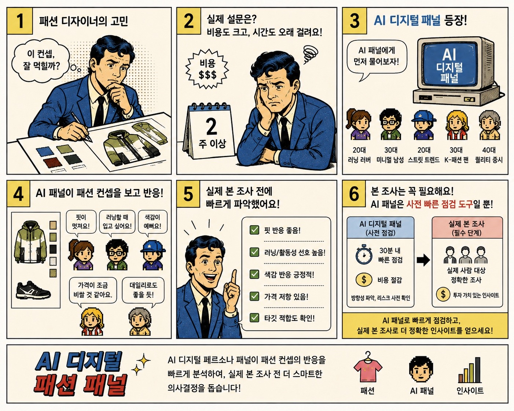
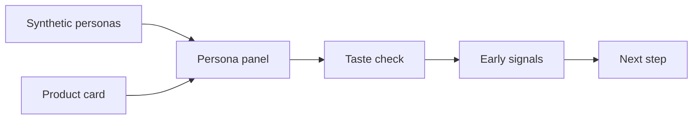
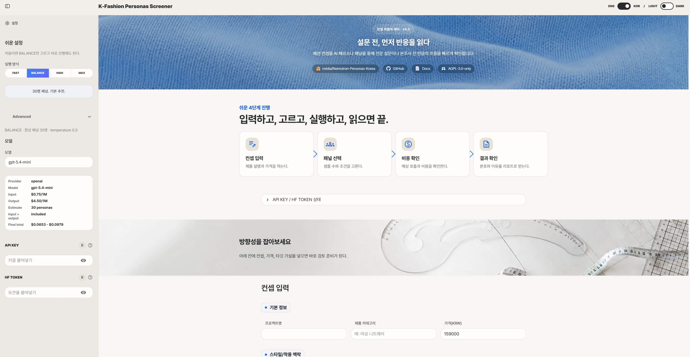
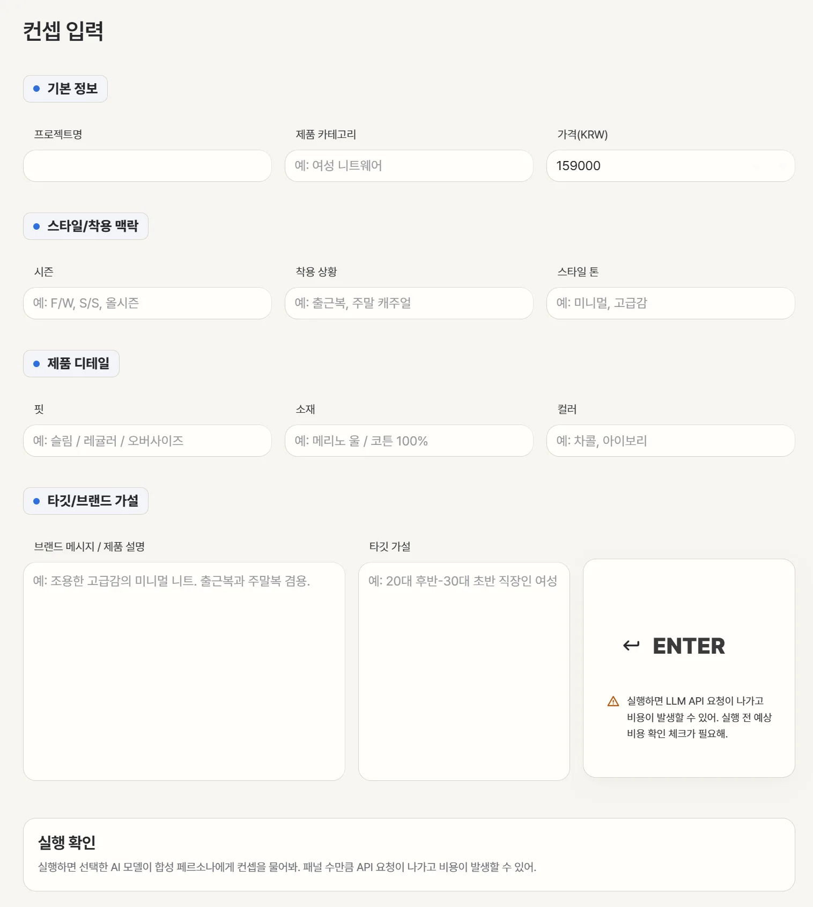

# k-fashion-persona



## K-fashion 컨셉을 AI 페르소나로 먼저 점검

[](pyproject.toml)
[](https://huggingface.co/datasets/nvidia/Nemotron-Personas-Korea)
[](https://github.com/woooya129-ai/k-fashion-persona)
[](https://huggingface.co/spaces/w00ya/k-fashion-persona)
[](https://w00ya-k-fashion-persona.hf.space)
[](https://github.com/woooya129-ai/us-fashion-persona)
[](docs/INSTALL.md)
[](README-ENG.md)
[](LICENSE)
[](CITATION.cff)
[](https://www.linkedin.com/in/woody-kim-ab2741403/)

k-fashion-persona는 패션 제품 컨셉을 실제 출시하거나 본조사를 하기 전에 AI 합성 페르소나 관점으로 점검하는 local-first 도구입니다.

미국 패션 컨셉용 쌍둥이 프로젝트는 [us-fashion-persona](https://github.com/woooya129-ai/us-fashion-persona)입니다.

## HF Space 라이선스 고지

- 원본 GitHub 저장소는 [woooya129-ai/k-fashion-persona](https://github.com/woooya129-ai/k-fashion-persona)입니다.
- 실행 가능한 HF Space는 [w00ya/k-fashion-persona](https://huggingface.co/spaces/w00ya/k-fashion-persona)입니다.
- 이 HF Space의 코드 라이선스는 **GNU AGPL-3.0-only**입니다.
- HF Space가 `protected` 상태여도 라이선스가 없어지는 것은 아닙니다. `protected`는 Hugging Face Hub에서 소스 표시와 clone을 제한하는 배포 설정입니다.
- 실행 앱 접근 권한은 소스 코드 사용권 이전, 독점 사용권, 상업적 재라이선스 허가를 의미하지 않습니다.
- 이 코드를 수정해 네트워크 서비스로 제공하는 경우 AGPL-3.0-only의 소스 제공 의무를 검토해야 합니다.
- 기본 페르소나 데이터셋인 NVIDIA Nemotron-Personas-Korea는 **CC BY 4.0 attribution** 대상입니다.
- 전체 라이선스와 고지는 [LICENSE](LICENSE), [NOTICE](NOTICE), [THIRD_PARTY_NOTICES](docs/THIRD_PARTY_NOTICES.md)를 기준으로 합니다.

제품 카드에 카테고리, 가격, 핏, 소재, 컬러, 시즌, 착용 상황, 스타일 톤, 브랜드 메시지, 타깃 가설을 입력하면 여러 합성 페르소나가 해당 컨셉을 어떻게 받아들일 수 있는지 확인할 수 있습니다.

이 도구는 실제 소비자 반응, 구매율, 매출, 시장 점유율을 예측하는 서비스가 아닙니다. 본조사 전에 관심 이유, 망설임, 가격 부담, 소재/핏/코디 리스크 같은 초기 신호를 정리하는 보조 도구입니다.







## 주요 기능

- 한국 맥락의 합성 페르소나 패널 구성
- 제품 카드 기반 컨셉 입력
- 연령, 성별, 지역, 직업 필터
- seed 기반 샘플링
- LLM provider/model 선택
- 선택한 AI provider API key 화면 입력
- Hugging Face token 입력 또는 외부 `.env` 사용
- KOSIS 공개 통계 스냅샷 선택
- 선택 시 KOSIS `statisticsData` API URL로 통계 갱신
- Markdown / CSV 리포트 다운로드

## 데이터와 통계

기본 페르소나 데이터셋은 [NVIDIA Nemotron-Personas-Korea](https://huggingface.co/datasets/nvidia/Nemotron-Personas-Korea)입니다. 실제 인물 데이터가 아니라 한국 맥락을 반영한 합성 페르소나 데이터셋입니다.

Hugging Face 공식 데이터셋 기준으로 이 데이터셋은 100만 레코드, 700만 페르소나 설명, 26개 필드, 약 1.98GB Parquet 파일로 제공됩니다. 앱 기본 모드는 Hugging Face `datasets` streaming 로딩을 사용하므로 전체 데이터셋을 한 번에 RAM에 올리지 않고, 로컬에서 필터링과 reservoir sampling을 수행합니다.

소득과 자산은 NVIDIA 데이터셋에 있는 개별 페르소나 속성으로 추정하거나 보강하지 않습니다. 리포트 작성 시 참고하는 소득, 자산, 의류·신발 지출 값은 [통계청(KOSTAT)](https://kostat.go.kr/)과 [국가통계포털(KOSIS)](https://kosis.kr/index)의 공개 통계를 기반으로 한 `data/public/kosis_household_context.csv` 스냅샷에서 가져옵니다.

KOSIS API key와 `statisticsData` URL을 입력하면 실행 시 해당 URL의 응답을 우선 참고합니다. API 갱신에 실패하거나 지원 항목을 찾지 못하면 저장소에 포함된 공개 통계 스냅샷으로 자동 fallback합니다. 보안상 KOSIS 갱신 URL은 `https://kosis.kr/openapi/statisticsData.do` 경로만 허용합니다.

이 통계는 가구 단위 집계값입니다. 개별 합성 페르소나의 실제 소득, 자산, 구매력을 뜻하지 않습니다.

## 프롬프트 버전과 선택 자산

기본 프롬프트는 `prompts/concept_eval_ko_v0_3.md`입니다. `concept_eval_ko_v0_2`는 기존 캐시와 회귀 테스트 호환을 위해 유지하며, 평가 결과 스키마는 둘 다 `eval_v0_1`을 사용합니다.

첫 화면 배경용 선택 자산은 `design/hero-skyblue-fabric.png`, `design/direction-bg.png` 경로를 사용합니다. 파일이 없으면 앱은 기본 배경으로 fallback하고, 로그에 한 번만 알립니다.

## 로컬 실행 범위와 권장 사양

앱 UI, 데이터셋 필터링, 샘플링, 프롬프트 생성, SQLite 캐시, Markdown/CSV 리포트 생성은 사용자 PC에서 로컬로 실행됩니다. 기본 Hugging Face 데이터셋을 처음 사용할 때는 Hugging Face Hub에서 데이터셋을 읽어옵니다. LLM 평가는 사용자가 선택한 provider API 서버로 프롬프트를 전송합니다. KOSIS API 갱신을 켠 경우에만 KOSIS API에도 요청합니다.

API key는 앱이 저장하지 않습니다. 화면 입력값은 현재 Streamlit 세션에서만 쓰고, 반복 실행용 key는 저장소 밖 환경 파일 또는 OS 환경변수에서 읽습니다.

LLM API endpoint는 `config/pricing_config.yaml`에 등록된 `api_base_url` host만 허용합니다. 이 YAML을 직접 편집하면 허용 host도 바뀌므로, 배포본이나 공유 환경에서는 config 변경을 코드 리뷰 대상으로 봐야 합니다.

실행 시작 시 job 생성 전에 첫 페르소나 1건을 preflight로 호출해 JSON 파싱과 schema 검증을 먼저 확인합니다. 이 호출은 사용자의 provider API key로 과금될 수 있지만, 성공 결과는 캐시에 저장해 같은 실행의 첫 결과로 재사용합니다.

HF Space 배포는 Docker SDK로 Streamlit 앱을 실행합니다. Space routing은 이 파일 상단의 `sdk: docker`, `app_port: 7860` 설정과 root `Dockerfile`을 기준으로 합니다.

현재 버전은 로컬 LLM 또는 로컬 Vision 모델을 돌리지 않으므로 그래픽카드는 필요하지 않습니다.

| 구분 | 최소 | 권장 |
|---|---:|---:|
| CPU | 2코어 이상 | 4코어 이상 |
| RAM | 8GB | 16GB 이상 |
| 저장공간 | 5GB 이상 여유 | 10-20GB 이상 여유 |
| GPU | 필요 없음 | 필요 없음 |
| 네트워크 | HF 데이터셋 로딩과 LLM API 호출에 필요 | 안정적인 broadband 권장 |

주의:

- HF 기본 모드는 streaming 로딩이라 1.98GB 데이터셋 전체를 RAM에 올리지 않습니다.
- 로컬 CSV/Parquet 파일 모드는 pandas로 파일을 읽으므로 큰 파일은 RAM을 더 씁니다. 전체 2GB급 Parquet/CSV를 로컬 파일로 직접 읽을 계획이면 16-32GB RAM을 권장합니다.
- `MAX`처럼 큰 샘플을 실행하면 RAM보다 LLM API 비용과 실행 시간이 먼저 증가합니다.
- 향후 로컬 LLM/Vision 모델을 직접 돌리는 모드를 추가한다면 GPU 요구사항은 별도로 생깁니다. 현재 공개 버전 기준으로는 GPU를 쓰지 않습니다.

## 빠른 실행

필요 조건:

- Git
- Python 3.11 이상
- `uv`
- 사용할 LLM provider API key
- 필요 시 Hugging Face token
- 선택 사항: KOSIS API key

```bash
git clone https://github.com/woooya129-ai/k-fashion-persona.git
cd k-fashion-persona
uv sync --all-extras --dev
uv run streamlit run src/app.py
```

브라우저에서 엽니다.

```text
http://localhost:8501
```

정적 문서 버튼까지 로컬에서 열고 싶으면 다른 터미널에서 실행합니다.

```bash
uv run python -m http.server 8510
```

자세한 설치와 실행 방법은 [docs/INSTALL.md](docs/INSTALL.md)를 참고하세요.

## API Key 설정

가장 쉬운 방식은 앱 화면의 password 입력칸에 key를 붙여넣는 것입니다. 입력값은 화면에 그대로 노출하지 않고 저장소에도 저장하지 않습니다.

반복 실행이 필요하면 저장소 밖에 환경 파일을 둡니다.

### macOS / Linux

```bash
mkdir -p ~/secrets/k-fashion
cp .env.example ~/secrets/k-fashion/.env
```

### Windows PowerShell

```powershell
New-Item -ItemType Directory -Force "$HOME\secrets\k-fashion"
Copy-Item .env.example "$HOME\secrets\k-fashion\.env"
```

환경 파일 예시:

```env
OPENAI_API_KEY=
ANTHROPIC_API_KEY=
GOOGLE_API_KEY=
GROQ_API_KEY=
DEEPSEEK_API_KEY=
QWEN_API_KEY=
HF_TOKEN=
KOSIS_API_KEY=
KOSIS_STATISTICS_DATA_URL=
```

`GOOGLE_API_KEY`는 Google AI Studio의 Gemini API key 기준입니다. Vertex AI key가 아닙니다.
Groq, DeepSeek, Qwen 같은 OpenAI-compatible provider는 `pricing_config.yaml`의 `api_key_env`에 지정된 환경변수를 사용합니다.

저장소 root에 실제 `.env` 파일을 두거나 commit하지 마세요.

## 사용 방법

1. Streamlit 앱을 실행합니다.
2. LLM provider와 model을 선택합니다.
3. provider API key를 입력합니다.
4. 필요하면 `HF TOKEN`을 입력합니다.
5. KOSIS 기준 계층을 고릅니다.
6. 선택 사항으로 `KOSIS API KEY`와 `KOSIS statisticsData URL`을 입력하고 API 갱신을 켭니다.
7. 제품 카드를 입력합니다.
8. sample size, seed, 필터를 조정합니다.
9. 예상 비용과 시간을 확인합니다.
10. `ENTER`를 눌러 실행합니다.
11. 결과 리포트를 Markdown 또는 CSV로 내려받습니다.

제품 카드 입력 항목:

- 카테고리
- 가격
- 핏 / 실루엣
- 소재
- 컬러
- 시즌
- 착용 상황
- 스타일 톤
- 타깃 가설
- 브랜드 메시지 / 제품 설명

로컬 CSV 또는 Parquet 파일을 사용할 경우 `data/` 하위에 두어야 합니다. 권장 위치는 `data/raw/`입니다.

## 리포트 예시

아래는 프로그램 실행 후 다운로드할 수 있는 Markdown 리포트의 축약 예시입니다. 수치는 예시용이며 실제 결과는 입력 컨셉, 페르소나 필터, provider/model, sampling seed, KOSIS 기준 계층에 따라 달라집니다.

예시 입력 컨셉:

- 카테고리: 여성용 봄 트렌치 재킷
- 가격: 189,000원
- 핏/소재: 세미오버핏, 생활방수 코튼 혼방
- 컬러: 라이트 카키, 네이비
- 착용 상황: 출근, 주말 외출, 간절기 여행
- 타깃 가설: 25세부터 39세까지의 직장인 여성

```markdown
# k-fashion-persona — 합성 패널 분석 리포트

> **주의**: 방향성 참고용. 세그먼트 비교 부적합

## 합성 패널 40명 기준 반응 분포

| 항목 | 값 |
|---|---|
| 긍정 반응 | 18명 / 45.0% |
| 중립 반응 | 14명 / 35.0% |
| 부정 반응 | 8명 / 20.0% |
| 평균 관심도 | 6.4 / 10 |
| 가격 부담도 high 이상 | 13명 / 32.5% |
| 파싱 실패/제외 | 3명 |

## KOSIS 참고 통계

- 기준 계층: 전국 전체
- 참고 기간: 2025_Q4, 2025, 2024
- 가격 기준값: 2,136,000원 (연간 환산 의류·신발 지출)
- 제품 가격 / 기준값: 0.09배 (medium)

| 항목 | 값 | 기간 | 출처 |
|---|---:|---|---|
| 연간 환산 의류·신발 지출 | 2,136,000원 | 2025_Q4 | 2025년 4/4분기 가계동향조사 결과 |
| 월평균 의류·신발 지출 | 178,000원 | 2025_Q4 | 2025년 4/4분기 가계동향조사 결과 |
| 월평균 가구소득 | 5,422,000원 | 2025_Q4 | 2025년 4/4분기 가계동향조사 결과 |
| 평균 가구자산 | 566,780,000원 | 2025 | 2025년 가계금융복지조사 결과 |
| 평균 가구순자산 | 471,440,000원 | 2025 | 2025년 가계금융복지조사 결과 |

> 위 값은 KOSIS/KOSTAT 가구 단위 집계 통계이며, 개별 페르소나의 실제 소득·자산·구매력을 뜻하지 않습니다.

## 결과 품질

| 항목 | 수 |
|---|---|
| 성공 | 40명 |
| 파싱 실패 | 2명 |
| API 실패 | 1명 |
| 분포 계산 포함 | 40명 |

## 가격 부담도 분포

| 라벨 | 명수 |
|---|---|
| low | 9명 |
| medium | 18명 |
| high | 10명 |
| very_high | 3명 |
| unknown | 0명 |

## 주요 긍정 이유 (합성 패널 응답 기준)

- 출근복과 주말 외출복으로 모두 활용 가능 (7건)
- 라이트 카키 컬러가 봄 시즌과 잘 맞음 (5건)
- 생활방수 소재가 간절기 외출에 실용적 (4건)

## 주요 망설임 이유 (합성 패널 응답 기준)

- 189,000원 가격이 기본 아우터로는 부담됨 (6건)
- 세미오버핏이 체형에 따라 부해 보일 수 있음 (4건)
- 관리 방법과 구김 정도가 더 궁금함 (3건)

## 패션 위험 신호 (합성 패널 main_concerns 분류)

| 카테고리 | 신호 수 | 대표 concern 예시 |
|---|---:|---|
| 가격 부담 | 6 | 가격이 부담됨, 예산 대비 높음 |
| 핏 리스크 | 4 | 세미오버핏이 부해 보일 수 있음 |
| 소재/관리 부담 | 3 | 구김과 세탁 관리가 걱정됨 |
| 코디 난이도 | 2 | 라이트 카키 코디가 제한적일 수 있음 |
| 착용 상황 불일치 | 1 | 격식 있는 출근복으로는 애매함 |
| 구매 망설임 | 2 | 비슷한 대체품이 많음 |
| 스타일 부담 | 1 | 트렌치 디자인이 다소 평범함 |

## 수정 제안 후보 (deterministic rule, LLM 호출 없음)

1. **가격 부담** (신호 6건)
   - 소재/디테일/구성 대비 가격 설명을 강화하거나, 더 낮은 엔트리 가격 옵션을 함께 제시하는 방향이 후보입니다.
2. **핏 리스크** (신호 4건)
   - 사이즈 가이드, 착용 컷, 체형별 안내를 보강하는 방향이 후보입니다.
3. **소재/관리 부담** (신호 3건)
   - 세탁/관리 난이도 안내를 보강하거나 대체 소재 검토를 함께 표시하는 방향이 후보입니다.

## 대표 페르소나 반응 (추상화 라벨, 원문 비포함)

| 세그먼트 | 반응 | 관심도 | 대표 긍정 이유 |
|---|---|---:|---|
| 28세 / 서울 / 사무직 | positive | 8 | 출근복과 주말 외출복으로 모두 활용 가능 |
| 34세 / 경기 / 전문직 | neutral | 5 | 컬러와 소재는 무난하나 가격 설명이 더 필요함 |
| 41세 / 인천 / 자영업 | negative | 3 | 비슷한 대체품 대비 차별 포인트가 약함 |

---

본 도구는 합성 페르소나와 LLM 기반의 사전 가설 분석 도구입니다.
실제 소비자 조사, 매출 예측, 법률 자문, 최종 사업 판단을 대체하지 않습니다.
Persona dataset: NVIDIA Nemotron-Personas-Korea, CC BY 4.0.
Dataset URL: https://huggingface.co/datasets/nvidia/Nemotron-Personas-Korea
CC BY 4.0: https://creativecommons.org/licenses/by/4.0/
k-fashion-persona.
Public statistics context uses Statistics Korea (KOSTAT) / KOSIS household clothing-footwear spending, income, and asset statistics; it does not infer individual income or assets.
Built with Codex and Claude Code.
Contact: woooya129 [at] gmail [dot] com
```

CSV 리포트는 같은 내용을 `section,key,value` 컬럼으로 평면화합니다.

```csv
section,key,value
반응분포,합성 패널 40명 기준 - 긍정,18명 / 45.0%
KOSIS참고통계,기준 계층,전국 전체
KOSIS참고통계,가격 기준값,"2,136,000원"
KOSIS참고통계_항목,월평균 가구소득,"5,422,000원 | 2025_Q4 | 2025년 4/4분기 가계동향조사 결과"
패션위험신호,가격 부담,6건
수정제안,rank1_price_burden,가격 부담 (신호 6건): 소재/디테일/구성 대비 가격 설명을 강화하거나 더 낮은 엔트리 가격 옵션을 함께 제시하는 방향이 후보입니다.
대표페르소나반응,rank1,28세 / 서울 / 사무직 | positive | 관심도 8 | 출근복과 주말 외출복으로 모두 활용 가능
```

## 결과 해석

적절한 활용:

- 본조사 전에 설문 문항을 정리할 때
- 제품 설명에서 막히는 부분을 찾을 때
- 가격, 소재, 핏, 착용 상황 관련 리스크를 빠르게 훑을 때
- 브랜드 메시지가 특정 생활자 맥락에서 어떻게 읽힐지 점검할 때
- 여러 컨셉 후보를 비교하기 전 초기 필터링을 할 때

부적절한 활용:

- 실제 구매율 예측
- 실제 매출 예측
- 시장 점유율 예측
- 실제 소비자 조사의 대체
- 최종 출시 여부의 단독 판단
- 발주량 또는 생산량 결정의 단독 근거

## 한계

- 실제 소비자 데이터 기반 예측 모델이 아닙니다.
- 합성 페르소나 반응은 실제 구매 행동과 다를 수 있습니다.
- 데이터셋은 패션 구매 전용 데이터가 아닙니다.
- 이미지, 룩북, 착용 사진, 체형 정보는 기본 평가에 포함되지 않습니다.
- 브랜드 충성도, 구매 이력, 반품 이력, 사이즈 선호 같은 실제 커머스 데이터는 포함되지 않습니다.
- KOSIS/KOSTAT 값은 가구 단위 집계 통계이며 개별 페르소나의 실제 경제 상태가 아닙니다.
- 최종 판단은 실제 설문, 판매 데이터, 전문가 검토와 함께 해야 합니다.

## 라이선스와 출처

- 코드 라이선스: GNU AGPL-3.0-only
- 기본 페르소나 데이터셋: NVIDIA Nemotron-Personas-Korea
- 데이터셋 라이선스: CC BY 4.0 attribution 대상
- 통계 컨텍스트: KOSTAT / KOSIS 공개 통계

상업적 서비스나 폐쇄형 제품에 도입하려면 AGPL-3.0-only 라이선스 조건을 반드시 검토해야 합니다.

### 라이선스와 상용 도입

- Open source: GNU AGPL-3.0-only (`LICENSE` 파일)
- Commercial license: 상업적 폐쇄 도입, 사내 SaaS, 재배포 제품, AGPL 조건 적용이 어려운 사용은 별도 상용 라이선스 또는 듀얼 라이선스 협의 가능

문의: woooya129 [at] gmail [dot] com

### 출처와 방법론 인용

- 인용 형식: `CITATION.cff`
- 방법론과 권리 포지셔닝: `docs/METHODOLOGY_AND_RIGHTS.md`
- 이 저장소는 추상 아이디어 독점을 주장하지 않고, 공개 코드·문서·프롬프트·리포트 구조·브랜딩·상업 도입 계약의 경계를 명확히 둡니다.
- 기업의 폐쇄형 제품, 사내 SaaS, 유료 컨설팅 워크플로, 공식 브랜딩 사용은 상용 라이선스 협의 대상입니다.

Codex와 Claude Code를 함께 사용해 만들었습니다.

## v0.5.0 런타임 구조

- `src/app.py`: Streamlit 진입점과 테스트 호환용 공개 래퍼
- `src/app_config.py`: 앱 공통 상수와 실행 프리셋
- `src/ui/`: UI 문구, CSS, 정적 자산, 렌더링 함수
- `src/orchestrator/`: 데이터 로딩, 페르소나 payload 생성, 캐시, LLM 평가, 리포트 조립
- 기존 테스트가 `src.app`를 monkeypatch하는 경로는 유지

## Contact

woooya129 [at] gmail [dot] com
