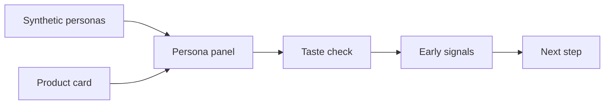

# k-fashion-persona


## K-fashion 컨셉을 AI 페르소나로 먼저 점검

[](https://huggingface.co/datasets/nvidia/Nemotron-Personas-Korea)
[](https://github.com/woooya129-ai/k-fashion-persona)
[](https://github.com/woooya129-ai/us-fashion-persona)
[](INSTALL.md)
[](LICENSE)
[](https://www.linkedin.com/in/woody-kim-ab2741403/)

k-fashion-persona는 패션 제품 컨셉을 실제 출시하거나 본조사를 하기 전에 AI 합성 페르소나 관점으로 빠르게 점검하는 local-first 도구입니다.

미국 패션 컨셉용 쌍둥이 프로젝트는 [us-fashion-persona](https://github.com/woooya129-ai/us-fashion-persona)입니다.

제품 카드에 카테고리, 가격, 핏, 소재, 컬러, 시즌, 착용 상황, 스타일 톤, 브랜드 메시지, 타깃 가설을 입력하면 여러 합성 페르소나가 해당 컨셉을 어떻게 받아들일 수 있는지 확인할 수 있습니다.

이 도구는 실제 소비자 반응, 구매율, 매출, 시장 점유율을 예측하는 서비스가 아닙니다. 본조사 전에 어떤 부분에서 관심이 생기고, 어떤 부분에서 망설임이 생길 수 있는지 초기 신호를 확인하는 보조 도구입니다.



NVIDIA Nemotron-Personas-Korea는 한국 맥락을 반영한 합성 페르소나 데이터셋입니다. 이 도구는 제품 카드를 여러 합성 페르소나에게 보여주는 방식으로, 본 설문조사 전에 취향 적합성, 관심 이유, 망설임, 리스크 신호를 빠르게 훑어봅니다.

이 방식이 가능한 이유는 실제 구매를 예측하려는 것이 아니라, 제품 설명을 봤을 때 어떤 지점에서 관심이 생기고 어떤 지점에서 막히는지 early signal을 보는 용도이기 때문입니다. 최종 판단은 실제 설문, 판매 데이터, 전문가 검토와 함께 해야 합니다.


## 무엇을 확인할 수 있나요?

- 제품 카테고리, 가격대, 핏과 실루엣, 소재, 컬러
- 시즌, 착용 상황, 스타일 톤
- 브랜드 메시지와 제품 설명
- 타깃 고객 가설과 브랜드 가설
- 페르소나별 관심 이유와 망설임 이유
- 가격 부담, 핏 리스크, 소재와 관리 부담
- 코디 난이도, 착용 상황 불일치, 스타일 부담
- Markdown 또는 CSV 결과 리포트 다운로드

## 작동 방식

1. 사용자가 패션 제품 컨셉을 입력합니다.
2. 한국 맥락의 합성 페르소나 데이터를 불러옵니다.
3. 연령, 성별, 지역, 직업 조건으로 페르소나를 필터링할 수 있습니다.
4. seed 기반 샘플링으로 평가할 페르소나 패널을 구성합니다.
5. 각 페르소나 관점에서 LLM이 제품 컨셉을 평가합니다.
6. 결과는 정해진 JSON 스키마로 검증됩니다.
7. 결과를 집계해 Markdown 또는 CSV 리포트로 확인할 수 있습니다.

## 리포트 예시

아래는 프로그램 실행 후 다운로드할 수 있는 Markdown 리포트의 축약 예시입니다. 수치는 예시용 합성 값이며, 실제 결과는 입력한 제품 컨셉, 페르소나 필터, provider/model, sampling seed에 따라 달라집니다.

예시 입력 컨셉:

- 카테고리: 여성용 봄 트렌치 재킷
- 가격: 189,000원
- 핏/소재: 세미오버핏, 생활방수 코튼 혼방
- 컬러: 라이트 카키, 네이비
- 착용 상황: 출근, 주말 외출, 간절기 여행
- 타깃 가설: 25세부터 39세까지의 직장인 여성

```markdown
# k-fashion-persona — 합성 패널 분석 리포트

> **주의**: 방향성 참고용. 세그먼트 비교 부적합

## 합성 패널 40명 기준 반응 분포

| 항목 | 값 |
|---|---|
| 긍정 반응 | 18명 / 45.0% |
| 중립 반응 | 14명 / 35.0% |
| 부정 반응 | 8명 / 20.0% |
| 평균 관심도 | 6.4 / 10 |
| 가격 부담도 high 이상 | 13명 / 32.5% |
| 파싱 실패/제외 | 3명 |

## 결과 품질

| 항목 | 수 |
|---|---|
| 성공 | 40명 |
| 파싱 실패 | 2명 |
| API 실패 | 1명 |
| 분포 계산 포함 | 40명 |

## 가격 부담도 분포

| 라벨 | 명수 |
|---|---|
| low | 9명 |
| medium | 18명 |
| high | 10명 |
| very_high | 3명 |
| unknown | 0명 |

## 주요 긍정 이유 (합성 패널 응답 기준)

- 출근복과 주말 외출복으로 모두 활용 가능 (7건)
- 라이트 카키 컬러가 봄 시즌과 잘 맞음 (5건)
- 생활방수 소재가 간절기 외출에 실용적 (4건)

## 주요 망설임 이유 (합성 패널 응답 기준)

- 189,000원 가격이 기본 아우터로는 부담됨 (6건)
- 세미오버핏이 체형에 따라 부해 보일 수 있음 (4건)
- 관리 방법과 구김 정도가 더 궁금함 (3건)

## 패션 위험 신호 (합성 패널 main_concerns 분류)

| 카테고리 | 신호 수 | 대표 concern 예시 |
|---|---:|---|
| 가격 부담 | 6 | 가격이 부담됨, 예산 대비 높음 |
| 핏 리스크 | 4 | 세미오버핏이 부해 보일 수 있음 |
| 소재/관리 부담 | 3 | 구김과 세탁 관리가 걱정됨 |
| 코디 난이도 | 2 | 라이트 카키 코디가 제한적일 수 있음 |
| 착용 상황 불일치 | 1 | 격식 있는 출근복으로는 애매함 |
| 구매 망설임 | 2 | 비슷한 대체품이 많음 |
| 스타일 부담 | 1 | 트렌치 디자인이 다소 평범함 |

> 분류 대상 concern 총 19건 중 미분류 0건 (키워드 매칭 안 됨, 수정 제안에서는 제외).

## 가격 부담 해석

- 가격 부담도 high 이상: 13명 / 32.5%
- main_concerns 가격 관련 신호: 6건
- 대표 concern: 가격이 부담됨, 예산 대비 높음

> 합성 패널 응답 기준의 가격 신호 분포일 뿐, 실제 가격 수용성이나 실제 결제 결정의 근거가 아닙니다.

## 스타일/코디 장벽

- 핏 리스크: 4건 — 세미오버핏이 부해 보일 수 있음
- 소재/관리 부담: 3건 — 구김과 세탁 관리가 걱정됨
- 코디 난이도: 2건 — 라이트 카키 코디가 제한적일 수 있음
- 착용 상황 불일치: 1건 — 격식 있는 출근복으로는 애매함
- 스타일 부담: 1건 — 트렌치 디자인이 다소 평범함

## 구매 망설임

- 구매 망설임 신호: 2건
- 대표 concern: 비슷한 대체품이 많음

## 수정 제안 후보 (deterministic rule, LLM 호출 없음)

1. **가격 부담** (신호 6건)
   - 소재/디테일/구성 대비 가격 설명을 강화하거나, 보다 낮은 엔트리 가격 옵션을 함께 제시하는 방향이 후보입니다.
2. **핏 리스크** (신호 4건)
   - 사이즈 가이드, 착용 컷, 체형별 안내를 보강하는 방향이 후보입니다.
3. **소재/관리 부담** (신호 3건)
   - 세탁/관리 난이도 안내를 보강하거나 대체 소재 검토를 함께 표시하는 방향이 후보입니다.

> 위 제안은 합성 패널 응답을 키워드 규칙으로 분류한 결과를 기반으로 한 후보 방향이며, 실제 소비자 의견을 대체하거나 실제 매출/판매 결과를 보장하지 않습니다.

## 대표 페르소나 반응 (추상화 라벨, 원문 비포함)

| 세그먼트 | 반응 | 관심도 | 대표 긍정 이유 |
|---|---|---:|---|
| 28세 / 서울 / 사무직 | positive | 8 | 출근복과 주말 외출복으로 모두 활용 가능 |
| 34세 / 경기 / 전문직 | neutral | 5 | 컬러와 소재는 무난하나 가격 설명이 더 필요함 |
| 41세 / 인천 / 자영업 | negative | 3 | 비슷한 대체품 대비 차별 포인트가 약함 |

---

본 도구는 합성 페르소나와 LLM 기반의 사전 가설 분석 도구입니다.
실제 소비자 조사, 매출 예측, 법률 자문, 최종 사업 판단을 대체하지 않습니다.
Data source (only external dataset): NVIDIA Nemotron-Personas-Korea, CC BY 4.0.
Dataset URL: https://huggingface.co/datasets/nvidia/Nemotron-Personas-Korea
CC BY 4.0: https://creativecommons.org/licenses/by/4.0/
k-fashion-persona.
Built with Codex and Claude Code.
Contact: woooya129 [at] gmail [dot] com
```

CSV 리포트는 같은 내용을 `section,key,value` 컬럼으로 평면화합니다.

```csv
section,key,value
반응분포,합성 패널 40명 기준 - 긍정,18명 / 45.0%
반응분포,평균 관심도,6.4 / 10
패션위험신호,가격 부담,6건
수정제안,rank1_price_burden,가격 부담 (신호 6건): 소재/디테일/구성 대비 가격 설명을 강화하거나, 보다 낮은 엔트리 가격 옵션을 함께 제시하는 방향이 후보입니다.
대표페르소나반응,rank1,28세 / 서울 / 사무직 | positive | 관심도 8 | 출근복과 주말 외출복으로 모두 활용 가능
```

## 사용하는 데이터

기본 데이터셋은 [NVIDIA Nemotron-Personas-Korea](https://huggingface.co/datasets/nvidia/Nemotron-Personas-Korea)입니다.

이 데이터셋은 한국 맥락을 반영한 합성 페르소나 데이터셋입니다. 실제 인물 데이터가 아니며, 실제 소비자의 구매 행동을 직접 나타내지 않습니다.

로컬 CSV 또는 Parquet 파일을 사용할 경우 `data/` 하위에 두어야 합니다. 권장 위치는 `data/raw/`입니다.

## 실행 방식

이 앱은 hosted 서비스가 아니라 local-first 방식으로 실행됩니다. 사용자는 자신의 컴퓨터에서 앱을 실행하고, 자신이 보유한 LLM provider API key를 입력해 사용합니다.

기본 실행 방식은 Streamlit 앱입니다.

필요 조건:

- Python 3.11 이상
- uv
- Streamlit
- 사용할 LLM provider의 API key
- 필요 시 Hugging Face 접근 권한

실행 예시:

```bash
git clone https://github.com/woooya129-ai/k-fashion-persona.git
cd k-fashion-persona
uv sync --all-extras --dev
uv run streamlit run src/app.py
```

브라우저에서 `http://localhost:8501`을 엽니다.

자세한 설치와 실행 방법은 [INSTALL.md](INSTALL.md)를 참고하세요.

## API key와 데이터 보관

API key는 저장소에 넣지 않는 것이 원칙입니다. 기본 방식은 Streamlit 화면의 password 입력칸에 API key를 직접 입력하는 것입니다.

API key, Hugging Face token, cache, outputs, raw data는 공개 저장소에 포함하지 않습니다.

실행 메타데이터는 로컬 SQLite DB에 저장됩니다.

기본 위치:

```text
cache/screener.db
```

저장되는 정보의 예:

- dataset source
- dataset split
- dataset revision
- 후보 페르소나 수
- 최종 샘플 수
- sampling seed
- sampling strategy
- filter summary
- provider
- model
- prompt version
- schema version
- concept hash
- price context hash

별도 컬럼으로 저장하지 않는 정보:

- raw API key
- Hugging Face token
- raw provider response
- raw concept text

## 결과 해석 방법

결과는 합성 페르소나 기반 가설입니다.

적절한 활용:

- 본조사 전에 설문 문항을 정리할 때
- 제품 설명에서 막히는 부분을 찾을 때
- 가격, 소재, 핏, 착용 상황 관련 리스크를 빠르게 훑을 때
- 브랜드 메시지가 특정 생활자 맥락에서 어떻게 읽힐지 점검할 때
- 여러 컨셉 후보를 비교하기 전 초기 필터링을 할 때

부적절한 활용:

- 실제 구매율 예측
- 실제 매출 예측
- 시장 점유율 예측
- 실제 소비자 조사의 대체
- 최종 출시 여부의 단독 판단
- 발주량 또는 생산량 결정의 단독 근거

## 장점

- 한국 맥락의 합성 페르소나를 활용합니다.
- 패션 제품 카드 형식으로 입력할 수 있습니다.
- 로컬에서 실행할 수 있습니다.
- API key와 원본 데이터를 공개 저장소에 넣지 않는 구조입니다.
- seed 기반 샘플링으로 실행 재현성을 높입니다.
- LLM 결과를 정해진 스키마로 검증합니다.
- 가격, 핏, 소재, 코디, 착용 상황, 스타일 부담 같은 패션 리스크를 정리합니다.
- Markdown과 CSV 리포트를 생성할 수 있습니다.

## 한계

- 실제 소비자 데이터 기반 예측 모델이 아닙니다.
- 합성 페르소나 반응은 실제 구매 행동과 다를 수 있습니다.
- 데이터셋은 패션 구매 전용 데이터가 아닙니다.
- 이미지, 룩북, 착용 사진, 체형 정보는 기본 평가에 포함되지 않습니다.
- 브랜드 충성도, 구매 이력, 반품 이력, 사이즈 선호 같은 실제 커머스 데이터는 포함되지 않습니다.
- LLM 응답은 그럴듯할 수 있지만, 실제 시장 검증을 대체하지 않습니다.
- 최종 판단은 실제 설문, 판매 데이터, 전문가 검토와 함께 해야 합니다.

## 추천 사용 시나리오

적합한 사용자:

- 패션 브랜드 상품기획자
- MD
- 마케터
- UX 리서처
- D2C 브랜드 운영자
- 패션 AI 서비스 기획자
- 패션 컨셉 테스트를 빠르게 하고 싶은 개발팀

적합한 상황:

- 출시 전 제품 컨셉을 빠르게 점검하고 싶을 때
- 여러 타깃 가설을 비교하고 싶을 때
- 제품 설명 문구의 약점을 찾고 싶을 때
- 가격 부담 또는 소재/핏 관련 리스크를 미리 보고 싶을 때
- 본조사 전에 질문 방향을 정리하고 싶을 때

## 라이선스와 출처

코드 라이선스:

- GNU AGPL-3.0-only

기본 데이터셋:

- NVIDIA Nemotron-Personas-Korea

데이터셋 라이선스:

- CC BY 4.0 attribution 대상

상업적 서비스나 폐쇄형 제품에 도입하려면 AGPL-3.0-only 라이선스 조건을 반드시 검토해야 합니다.

Codex와 Claude Code를 함께 사용해 만들었습니다.
